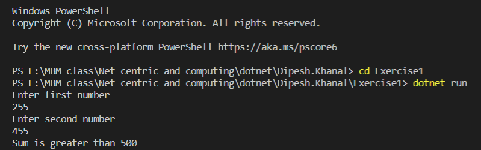
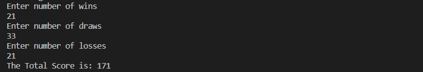
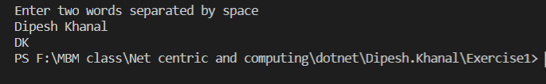

# Dipesh.Khanal

# Assignment1
- [x]  Given two numbers, write C# method that returns true if sum of both numbers is greater than 500. Otherwise returns false.

     

- [x] Create a function that takes the number of wins, draws and losses, and calculates the number of points a football team has obtained so far. Rule - wins get 5 points, draws get 2 point and losses get 0 points.

    
- [x] Creates a function that takes a two word string separated by space and returns the concatenated first characters of both the words. E.g. GetInitials("Bishnu Rawal") => "BR" GetInitials("Alex Wales") => "AW"

    